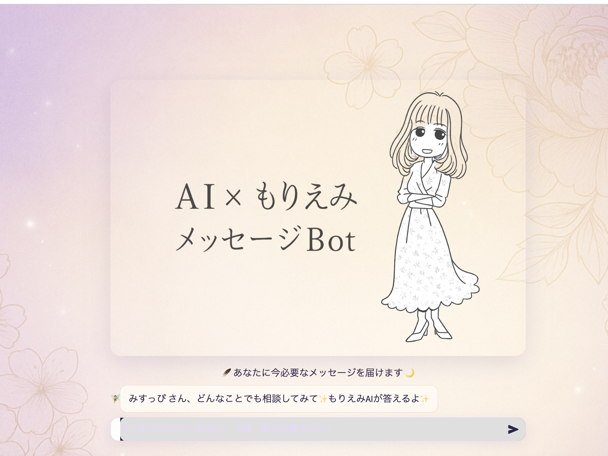

# Fortune-Telling × AI  
## “Goddess Message Bot” — Web MVP (Streamlit)

🌸 **A calm, gentle AI chat experience that quietly leads to booking in 10 turns.**  
Designed with a **white × lavender × gold** aesthetic,  
this is a **conversation-first Web MVP** focused on tone, pacing, and emotional safety.

> ⚠️ Production use is recommended via **LINE integration**.  
> This Web version exists to refine the *conversation experience* before migration.

---

## 🌐 Live Demo (Deploy)

👉 **https://zitatori-mymother-s-ai-bot-app-dih0wo.streamlit.app/**

> The **deploy URL and app version** are displayed directly inside the UI  
> to avoid confusion between environments.

---

## ✨ Concept

- Not “predictive” fortune-telling, but **words that gently realign**
- No pressure, no urgency, no manipulation
- A quiet structure: **10 turns**, then an optional path to booking  
- The user always remains in control

---

## ✨ Features

- 🌙 Goddess-like tone inspired by *Morie-Emi* (via system prompt)
- 💬 Conversation history stored per user
- 🔢 **Booking CTA appears after 10 message turns**
- 🔁 Reset button to restart the conversation
- 🧭 App version & deploy URL visible in the UI

---

## 🌼 Preview

| UI Preview |
|:--:|
|  |

> 🎨 Theme colors: White × Lavender × Gold  
> 🌸 Floral inspiration: Peony / Sakura / Phalaenopsis  
> Designed to feel like a *quiet sacred space*.

---

## 🧰 Tech Stack

- **Python 3.12**
- **Streamlit**
- Pandas
- (Optional) OpenAI API or other LLM providers

> ℹ️ This project was **originally built with Flask**  
> and has since been **fully migrated to Streamlit**.

---

## 🧰 Local Setup

```bash
# 1) Create virtual environment
python -m venv .venv
source .venv/bin/activate  # Windows: .venv\Scripts\activate

# 2) Install dependencies
pip install -r requirements.txt

# 3) Environment variables
cp .env.example .env
# Edit .env and set OPENAI_API_KEY, etc.

# 4) Run the app
streamlit run app.py

